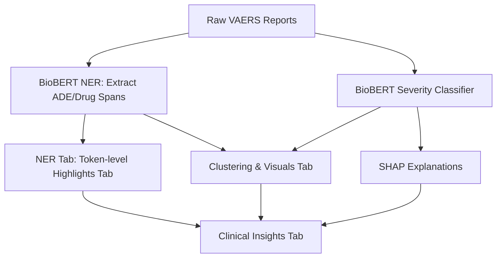

**Model Performance Reports**

[NER Metrics](https://github.com/Sugiuma/ADEGuard/blob/main/docs/training.png)

[NER Classification Report](https://github.com/Sugiuma/ADEGuard/blob/main/docs/classif_report.png)

[NER Model Card](https://github.com/Sugiuma/ADEGuard/blob/main/docs/NER_Model_Card.md)

[Severity Classifier Metrics](https://github.com/Sugiuma/ADEGuard/blob/main/docs/trainin_sev.png)

[Severity Classifier Classification Report](https://github.com/Sugiuma/ADEGuard/blob/main/docs/class_rep_seve.png)

[Severity Classifier Model Card](https://github.com/Sugiuma/ADEGuard/blob/main/docs/Severity_classifier_model_card.md)

[Project Report](https://github.com/Sugiuma/ADEGuard/blob/main/docs/Project_Report.md)

[Project pipeline](https://github.com/Sugiuma/ADEGuard/blob/main/docs/Pipeline.md)


## **How to Run**

Download the model from:
NER-model
https://drive.google.com/drive/folders/1oB6GrNepkSnDQxPUzDII6L7zJ06TvKU_?usp=drive_link

Severity Classifier model
https://drive.google.com/drive/folders/1Ay5FCmKnO2Q-RsL-1UT4TmkZSYKPoIjU?usp=sharing

Dataset used:
https://drive.google.com/drive/folders/1lLjR6yAmQdRTYWaVHkrgDDhRzQEgwvmE?usp=drive_link

## **Steps**
1. Clone the repo & Set up virtual environment.
   
2. Ensure dependencies are installed:

```bash
pip install -r requirements.txt
```
2a. cd src/ and Update your model_paths  in config file.

3. Run predictions on NER model (optional)

```bash
python inference_ner.py
```
4. Run predictions on Severity classifier model (optional)

```bash
python inference_severity.py
```

5. Run the Streamlit app

```bash
streamlit run app.py
```
   
Upload sample2.csv conatining `symptom_text`, `age`, (Check for sample in `data` folder in this repo). Also contains the final csv reports.

### Architecture of ADEGuard



### **Tab explanations**

| Tab                    | Description                                                                                 |
| ---------------------- | ------------------------------------------------------------------------------------------- |
| **NER Tab**            | Show extracted ADE/Drug spans token-by-token.                                               |
| **Severity Tab**       | Show predicted severity from BioBERT trained on Snorkel weak labels & SHAP explanations. |
| **Clustering Tab**     | Show modifier-aware + age-aware ADE clusters with interactive plots.                        |
| **Clinical Insights Tab**          | Combines all tabs for the full visualization experience & insights                       |

### 🛠️ **Tech Stack**

* **Data**: VAERS dataset (COVID-19 subset), weak labels from structured fields
* **Annotation**: Label Studio for gold standard ADE/DRUG span labeling
* **NLP Models**: BioBERT for NER, Severity Classifier, Sentence-BERT for embeddings
* **Clustering**: t-SNE + K means (modifier- & age-aware)
* **Classification**: Rule-based + BioBERT severity classifier (Weak labeling using Snorkel)
* **Explainability**: SHAP
* **UI**: Streamlit dashboard with token-level highlights, cluster plots, explainability visualizations, Clinical Insights(downloadable as csv)

## ⚙️ **Efficient Approaches in Model Deployment & Optimization**

### 🔹 **Model Architecture & Training Efficiency**
 **Layer Freezing for Efficient Fine-Tuning:**
  Only the task-specific classification head was trained while freezing the lower transformer layers of BioBERT. This reduced training time and GPU memory usage, while retaining pretrained biomedical linguistic knowledge.

### 🔹 **Weak Supervision & Label Enrichment**
 **Snorkel Labeling Functions & Label Model Aggregation:**
  Used rule-based heuristics and combined multiple label sources using Snorkel’s probabilistic label model to estimate true labels with confidence scores.

### 🔹 **Post-Processing & Interpretability**
 **Rule-Based Override Layer:**
  Implemented a rule-based hybrid logic to correct NER & classifier underestimation errors.
**SHAP-Based Explainability:**
  Visualized token-level contribution toward severity classification, aiding interpretability for clinical reviewers.

### 🔹 **Deployment**
 **Caching with @st.cache_resource:**
  Cached tokenizer, model, and SHAP explainer to avoid repeated reinitialization in Streamlit sessions.


