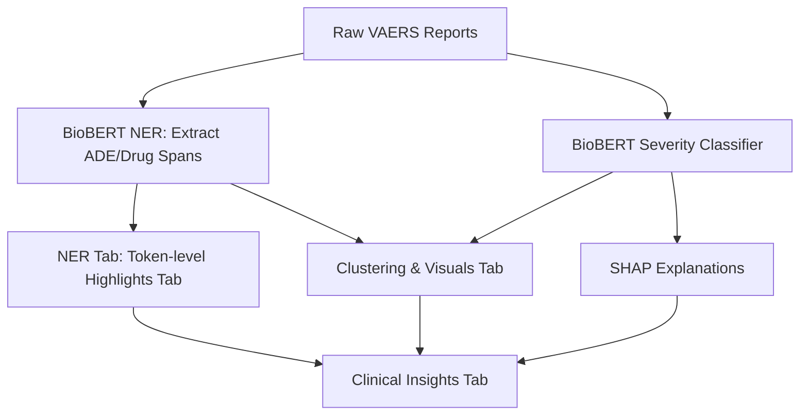

**Model Performance Reports**

[NER Metrics](https://github.com/Sugiuma/ADEGuard/blob/main/docs/training.png)

[NER Classification Report](https://github.com/Sugiuma/ADEGuard/blob/main/docs/classif_report.png)

[NER Model Card](https://github.com/Sugiuma/ADEGuard/blob/main/docs/NER_Model_Card.md)

[Severity Classifier Metrics](https://github.com/Sugiuma/ADEGuard/blob/main/docs/trainin_sev.png)

[Severity Classifier Classification Report](https://github.com/Sugiuma/ADEGuard/blob/main/docs/class_rep_seve.png)

[Severity Classifier Model Card](https://github.com/Sugiuma/ADEGuard/blob/main/docs/Severity_classifier_model_card.md)

[Project Report](https://github.com/Sugiuma/ADEGuard/blob/main/docs/Project_Report.md)

[Project pipeline](https://github.com/Sugiuma/ADEGuard/blob/main/docs/Pipeline.md)


## **How to Run**

Download the model from:
NER-model
https://drive.google.com/drive/folders/1oB6GrNepkSnDQxPUzDII6L7zJ06TvKU_?usp=drive_link

Severity Classifier model
https://drive.google.com/drive/folders/1Ay5FCmKnO2Q-RsL-1UT4TmkZSYKPoIjU?usp=sharing

## **Steps**
1. Clone the repo & Set up virtual environment.
   
2. Ensure dependencies are installed:

```bash
pip install -r requirements.txt
```
2a. cd src/ and Update your model_paths  in config file.

3. Run predictions on NER model

```bash
python inference_ner.py
```
4. Run predictions on Severity classifier model

```bash
python inference_severity.py
```

5. Run the Streamlit app

```bash
streamlit run app.py
```
   
Upload sample1.csv conatining `symptom_text`, `age`, (Check for sample in `data` folder in this repo)

### Architecture of ADEGuard



### **Tab explanations**

| Tab                    | Description                                                                                 |
| ---------------------- | ------------------------------------------------------------------------------------------- |
| **NER Tab**            | Show extracted ADE/Drug spans token-by-token.                                               |
| **Severity Tab**       | Show predicted severity from BioBERT trained on Snorkel weak labels & SHAP explanations. |
| **Clustering Tab**     | Show modifier-aware + age-aware ADE clusters with interactive plots.                        |
| **Clinical Insights Tab**          | Combines all tabs for the full visualization experience & insights                       |


Excellent — this is exactly the kind of technical insight you can highlight in a **project write-up or research summary** under *“Efficient or Creative Approaches in Model Deployment and Optimization.”*

Below is a set of **bullet points** covering freezing layers, Snorkel, and several other pre/post-processing and inference optimization techniques — phrased for inclusion in reports or presentations 👇

---

## ⚙️ **Efficient Approaches in Model Deployment & Optimization**

### 🔹 **Model Architecture & Training Efficiency**
 **Layer Freezing for Efficient Fine-Tuning:**
  Only the task-specific classification head was trained while freezing the lower transformer layers of BioBERT. This reduced training time and GPU memory usage, while retaining pretrained biomedical linguistic knowledge.

### 🔹 **Weak Supervision & Label Enrichment**
* **Snorkel Labeling Functions:**
  Used rule-based heuristics, keyword lists, and domain lexicons as labeling functions to automatically generate weak labels for unlabeled clinical text.
* **Label Model Aggregation:**
  Combined multiple noisy label sources using Snorkel’s probabilistic label model to estimate true labels with confidence scores.
* **Hybrid Label Refinement:**
  Combined Snorkel-generated weak labels with human-validated samples for semi-supervised model improvement.

### 🔹 **Post-Processing & Interpretability**
* **Rule-Based Override Layer:**
  Implemented a rule-based hybrid logic (e.g., keyword-based severity escalation for “high fever,” “hospitalized,” etc.) to correct classifier underestimation errors.
* **SHAP-Based Explainability:**
  Visualized token-level contribution toward severity classification, aiding interpretability for clinical reviewers.

### 🔹 **Inference Optimization & Deployment**
 **Caching with @st.cache_resource:**
  Cached tokenizer, model, and SHAP explainer to avoid repeated reinitialization in Streamlit sessions.


