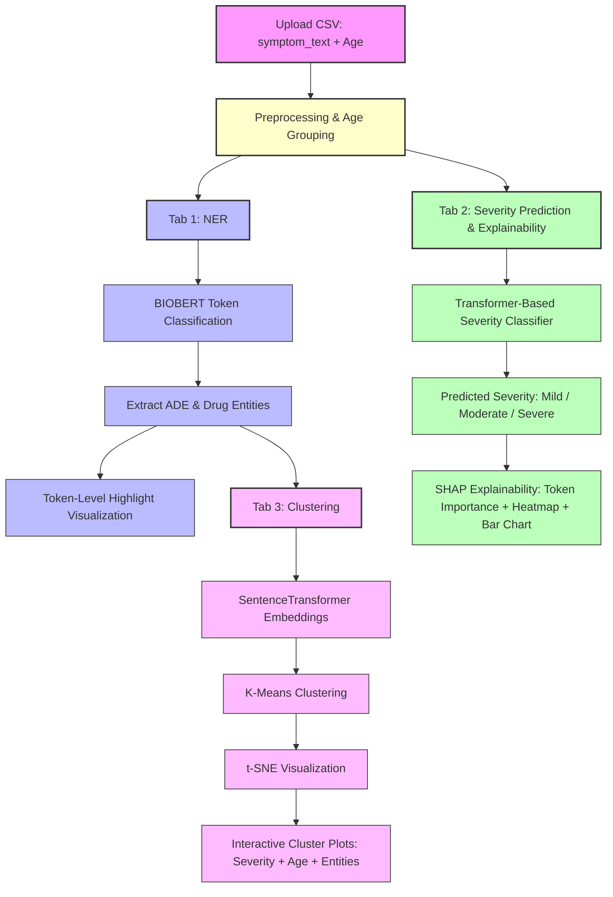

**Model Performance Reports**

[Metrics](https://github.com/Sugiuma/ADEGuard/blob/main/docs/training.png)

[Classification Report](https://github.com/Sugiuma/ADEGuard/blob/main/docs/classif_report.png)

[Project Report](https://github.com/Sugiuma/ADEGuard/blob/main/docs/Project_Report.md)

[Model Card](https://github.com/Sugiuma/ADEGuard/blob/main/docs/Model_Card.md)

[Project pipeline](https://github.com/Sugiuma/ADEGuard/blob/main/docs/Pipeline.md)


## **How to Run**

Download the model from:
https://drive.google.com/drive/folders/1pnQJfxpMILCO2r7FUH3wotmoJ6Y2vE4F?usp=sharing


## **Steps**
1. Clone the repo & Set up virtual environment.
   
2. Ensure dependencies are installed:

```bash
pip install -r requirements.txt
```
2a. Update your model_path in config file.

3. Run predictions

```bash
python inference.py
```
   
4. Run inference on a CSV batch_inference:

```bash
python batch_inference.py --input_csv batch_input.csv --output_csv predicted_entities.csv
```

* **`input.csv`** must have a column named `symptom_text`.
* The script outputs **`predicted_entities.csv`** with two new columns: `predicted_DRUG` and `predicted_ADE`.

5. Run the Streamlit app

```bash
streamlit run app.py
```
   
Upload sample1.csv conatining `symptom_text`, `age`, `severity columns`. (Check for sample in `data` folder in this repo)


Perfect! Here's a **Streamlit tab-focused Mermaid.js flow** that’s compact and maps directly to your UI tabs:


### **How it maps to your Streamlit app**

| Tab                    | Description                                                                                 |
| ---------------------- | ------------------------------------------------------------------------------------------- |
| **NER Tab**            | Show extracted ADE/Drug spans token-by-token.                                               |
| **Clustering Tab**     | Show modifier-aware + age-aware ADE clusters with interactive plots.                        |
| **Severity Tab**       | Show predicted severity (Severe/Moderate/Mild) from BioBERT trained on Snorkel weak labels. |
| **Explainability Tab** | SHAP/LIME explanations for why severity was predicted.                                      |
| **Dashboard**          | Combines all tabs for the full visualization experience.                                    |

---

This keeps your flow **compact, UI-oriented**, and clearly separates **clustering vs severity vs explainability**, while still showing NER as the common starting point.

If you want, I can **also add color/emoji hints** in Mermaid to visually distinguish **unsupervised (clustering) vs supervised (classifier) paths**, which makes it even easier to read.

Do you want me to do that?

Absolutely! We can **simplify and consolidate** the diagram so it’s more compact while still showing the key flows:


### ✅ **What changed**

1. **Merged modifier detection & age extraction** into one step.
2. **Merged clustering features** into a single box.
3. **Merged severity classifier & explainability** into one simplified flow.
4. Keeps **NER** as the central starting point and **Streamlit UI** as the integration point.


---

If you want, I can also **draw a “tab-focused” version** showing **NER Tab, Clustering Tab, Severity Tab, SHAP Tab** directly, which is even cleaner for a Streamlit layout.

Do you want me to do that next?

Excellent question — and yes, **your current model fits this stage perfectly** ✅
Let’s unpack why in the context of your ADEGuard pipeline.

---

## 🧩 Step: “Label Severity Levels”

> **Goal:** Assign a *final severity label* to each case using a hybrid of:
>
> * Rules (from VAERS structured fields, like HOSPITAL or DIED)
> * Manual / gold labels (from curated annotations, if available)
> * ML-based classifier (BioBERT fine-tuned on weak or gold labels)

---

### 💡 Your current model’s role

You already have:

* A **Snorkel-based weak labeling layer** → creates `weak_label_id` (Severe/Mild)
* A **BioBERT classifier fine-tuned** on those weak labels → learns to infer severity directly from **symptom text**

✅ So your model **is exactly the “BioBERT classification” component** mentioned in that step.

It’s the machine-learning leg of the hybrid labeling system.

---

### ⚙️ Here’s how the pieces fit

| Source                 | Example Signal                               | Strength                             | Component in Your Pipeline |
| ---------------------- | -------------------------------------------- | ------------------------------------ | -------------------------- |
| **Rule-based**         | `DIED = Y`, `L_THREAT = Y`                   | High precision, low recall           | Snorkel labeling functions |
| **Manual labels**      | Hand-verified severity tags                  | High precision, low coverage         | Optional (Label Studio)    |
| **BioBERT classifier** | “Patient developed severe headache” → Severe | Medium-high precision, generalizable | ✅ Your trained classifier  |

The **final severity decision** can then be:

```python
if rule_based_label == "Severe":
    final_label = "Severe"
else:
    final_label = classifier_prediction
```

or probabilistic:

```python
final_prob = 0.7 * clf_prob + 0.3 * rule_prob
```

---

### 🧠 Why your model is good for this role

* It’s **trained on text**, learning language patterns correlated with severity (e.g., “hospitalized”, “critical”, “unconscious”).
* It’s **BioBERT**, so it understands medical terminology.
* It’s **bootstrapped with Snorkel weak labels**, giving it grounding in structured field logic.

Even if your weak labels came from rules, the classifier:

* Learns richer **semantic cues** (beyond “severe” keyword)
* Can **generalize** to unseen phrases (e.g., “intensive care”, “needed oxygen”)
* Provides **probabilities**, which can help in hybrid logic or SHAP explainability.

---

### 🩺 Example of final severity adjudication flow


---

✅ **Bottom line:**
Yes — your **current BioBERT model is exactly what’s needed** for the
“Label Severity Levels → BioBERT classification” part.
It is the ML refinement layer that enhances rule-based severity determination.

---

Would you like me to show how to integrate your **BioBERT classifier + Snorkel weak labels** into a **hybrid adjudication function** (for your Streamlit tab “Severity”) — e.g., combining rule-based + classifier outputs dynamically?

Perfect! Here’s a **compact Mermaid diagram** showing all three main tabs/modules of ADEGuard in a single view, suitable for a presentation slide:



### 🔹 Notes for the diagram:

* **Three main tabs** are clearly separated:

  * Tab 1 = NER
  * Tab 2 = Severity + SHAP
  * Tab 3 = Clustering
* **Flow highlights dependencies**:

  * NER output feeds into both Clustering and Severity analysis
  * Severity analysis and SHAP are independent of clustering
* **Colors** help differentiate modules:

  * Input = pink
  * Preprocessing = light yellow
  * NER = light blue
  * Severity + SHAP = green
  * Clustering = purple

This version is compact enough to show in a single slide while still capturing the full workflow.

---

If you want, I can also make a **slide-ready “horizontal layout” Mermaid diagram** with arrows left-to-right instead of top-down, which often looks cleaner in presentations.

Do you want me to do that too?
