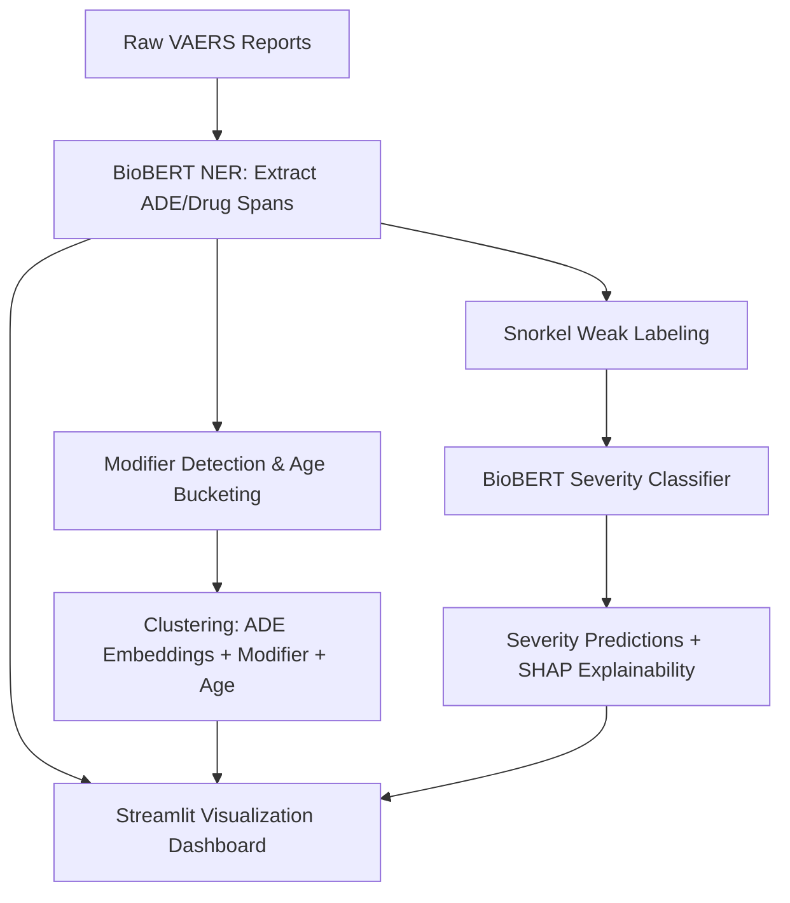

**Model Performance Reports**

[Metrics](https://github.com/Sugiuma/ADEGuard/blob/main/docs/training.png)

[Classification Report](https://github.com/Sugiuma/ADEGuard/blob/main/docs/classif_report.png)

[Project Report](https://github.com/Sugiuma/ADEGuard/blob/main/docs/Project_Report.md)

[Model Card](https://github.com/Sugiuma/ADEGuard/blob/main/docs/Model_Card.md)

[Project pipeline](https://github.com/Sugiuma/ADEGuard/blob/main/docs/Pipeline.md)


## **How to Run**

Download the model from:
https://drive.google.com/drive/folders/1pnQJfxpMILCO2r7FUH3wotmoJ6Y2vE4F?usp=sharing


## **Steps**
1. Clone the repo & Set up virtual environment.
   
2. Ensure dependencies are installed:

```bash
pip install -r requirements.txt
```
2a. Update your model_path in config file.

3. Run predictions

```bash
python inference.py
```
   
4. Run inference on a CSV batch_inference:

```bash
python batch_inference.py --input_csv batch_input.csv --output_csv predicted_entities.csv
```

* **`input.csv`** must have a column named `symptom_text`.
* The script outputs **`predicted_entities.csv`** with two new columns: `predicted_DRUG` and `predicted_ADE`.

5. Run the Streamlit app

```bash
streamlit run app.py
```
   
Upload sample1.csv conatining `symptom_text`, `age`, `severity columns`. (Check for sample in `data` folder in this repo)


Perfect! Here's a **Streamlit tab-focused Mermaid.js flow** that’s compact and maps directly to your UI tabs:


### **How it maps to your Streamlit app**

| Tab                    | Description                                                                                 |
| ---------------------- | ------------------------------------------------------------------------------------------- |
| **NER Tab**            | Show extracted ADE/Drug spans token-by-token.                                               |
| **Clustering Tab**     | Show modifier-aware + age-aware ADE clusters with interactive plots.                        |
| **Severity Tab**       | Show predicted severity (Severe/Moderate/Mild) from BioBERT trained on Snorkel weak labels. |
| **Explainability Tab** | SHAP/LIME explanations for why severity was predicted.                                      |
| **Dashboard**          | Combines all tabs for the full visualization experience.                                    |

---

This keeps your flow **compact, UI-oriented**, and clearly separates **clustering vs severity vs explainability**, while still showing NER as the common starting point.

If you want, I can **also add color/emoji hints** in Mermaid to visually distinguish **unsupervised (clustering) vs supervised (classifier) paths**, which makes it even easier to read.

Do you want me to do that?

Absolutely! We can **simplify and consolidate** the diagram so it’s more compact while still showing the key flows:



### ✅ **What changed**

1. **Merged modifier detection & age extraction** into one step.
2. **Merged clustering features** into a single box.
3. **Merged severity classifier & explainability** into one simplified flow.
4. Keeps **NER** as the central starting point and **Streamlit UI** as the integration point.

---

If you want, I can also **draw a “tab-focused” version** showing **NER Tab, Clustering Tab, Severity Tab, SHAP Tab** directly, which is even cleaner for a Streamlit layout.

Do you want me to do that next?


