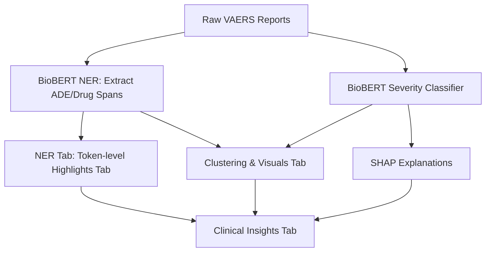

## 🧠 ADEGuard: Adverse Drug Event (ADE) Detection and Severity Analysis

## 🔷 1. Project Overview

**ADEGuard** is an intelligent text analytics system designed to automatically identify **Adverse Drug Events (ADEs)** from unstructured clinical narratives and analyze their **severity**.

It integrates three core AI capabilities into one interactive Streamlit dashboard:

1. **Named Entity Recognition (NER)** – Extract ADEs and Drug mentions from text using a BioBERT model.
2. **Severity Classification** – Categorize each ADE as *Severe*, *Moderate*, or *Mild* using a Transformer-based classifier.
3. **Explainability and Clustering** – Provide transparent explanations (via SHAP) and visualize latent ADE patterns using clustering.

This hybrid approach combines **data-driven NLP** with **explainable AI** to support clinical interpretation and pharmacovigilance.

## 🔷 2. System Architecture

## 🔷 3. Data Input and Preprocessing
### 📤 CSV Upload

The user uploads a `.csv` file containing two columns:

* `symptom_text` – free-text clinical description (e.g., *“Patient experienced high fever after dose.”*)
* `age` – patient’s age.

### 👶 Age Grouping

A preprocessing function categorizes patients into:

* **Child** (<18)
* **Young Adult** (18–39)
* **Middle Age** (40–59)
* **Senior** (≥60)

This enables **demographic analysis** of ADE severity patterns.

## 🔷 4. ADE/Drug Named Entity Recognition (NER)
### 📘 Model
A **BioBERT Token Classification** model is used, fine-tuned on biomedical entity recognition tasks.

### ⚙️ Functionality
* Tokenizes input text using BioBERT’s tokenizer.
* Predicts token-level labels:

  * `B-ADE`, `I-ADE` for Adverse Drug Events
  * `B-DRUG`, `I-DRUG` for Drugs
  * `O` for non-entities.
* Consecutive “B/I” tokens are merged to form complete entities (e.g., *“severe rash”*).

### 💡 Visualization
Each token is color-coded:
* 🔴 **Red:** ADE tokens
* 🔵 **Blue:** Drug tokens

This provides an interpretable token-level visualization of model predictions.

## 🔷 5. Severity Classification
### 📘 Model
A **Transformer-based Sequence Classification** model (BioBERT) fine-tuned for ADE severity.

### ⚙️ Prediction
* Input: Symptom narrative text.
* Output: Probability distribution across three classes — *Mild*, *Moderate*, *Severe*.
* Highest-probability class is chosen as the predicted label.

### 📊 Output Table
| symptom_text                            | pred_label |
| --------------------------------------- | ---------- |
| “Fever and chills”                 | Moderate   |
| “Slight pain at injection site”         | Mild       |
| “Anaphylaxis requiring hospitalization” | Severe     |

## 🔷 6. Explainability using SHAP
In healthcare AI, interpretability is crucial.
SHAP (SHapley Additive exPlanations) quantifies each token’s contribution to the model’s decision.

### ⚙️ Process
1. A SHAP explainer wraps the Hugging Face pipeline.
2. For a selected text sample, SHAP computes **per-token importance values**.
3. Tokens influencing the prediction more strongly receive higher SHAP values.

### 🎨 Visualization
* Tokens are highlighted in shades of red proportional to their importance.
* A bar chart displays top influential words.

### 📈 Output
* **Heatmap:** Redder tokens = stronger contribution to "Severe".
* **Bar Chart:** Word importance ranking for transparency.

## 🔷 7. Clustering and Pattern Discovery (Hybrid Analysis)
### 🧮 Embedding Model
A **SentenceTransformer (all-MiniLM-L6-v2)** converts extracted entity text (ADE + DRUG) into dense embeddings.

### ⚙️ Clustering
* K-Means groups similar ADE/Drug embeddings.
* t-SNE reduces dimensions for visualization.
* Clusters are visualized using Plotly.

### 🎨 Color Coding
* Color = Severity (High / Medium / Low)
* Hover Info = Entity details + Age group

### 🧠 Clinical Insight
Doctors can observe clusters such as:

* **Elderly + Severe Reactions** grouped together.
* **Mild ADEs** forming a distinct region.

This helps identify population-specific ADE trends.

## 🔷 8. Clinical Insight Dashboard

| Feature                                  | Purpose                                      |
| ---------------------------------------- | -------------------------------------------- |
| **Filters (Drug, ADE, Cluster)**         | Interactive exploration                      |
| **Bar charts**                           | Severity & age distribution overview         |
| **Summary Table**                        | Aggregated data for risk signal detection    |
| **Two sidebar downloads**                | 1️⃣ Raw Clustered Data, 2️⃣ Clinical Summary |

## 🩺 Example Workflow for Clinical Teams

1. **Select a Drug** → e.g., *Pfizer*
2. See **which ADEs** are linked and how severe they are
3. Review **age-specific distributions**
4. **Download** both CSVs:

   * `filtered_cases.csv` → for record-level audit
   * `clinical_summary.csv` → for reporting 

## 🔷 9. Integrated Dashboard
| **Tab**                          | **Module**                  | **Purpose**                       |
| -------------------------------- | --------------------------- | --------------------------------- |
| **1. NER**                       | BioBERT model               | Extract ADE and Drug entities     |
| **2. Severity + Explainability** | Classifier + SHAP           | Predict and explain severity      |
| **3. Clustering**                | SentenceTransformer + t-SNE | Visualize ADE similarity patterns |
| **4. Clinical Insights Dashboard** | Dedicated view for clinical reviewers        |

The dashboard provides both **automation** and **interpretability**, bridging the gap between AI and clinical reasoning.

## 🔷 10. Key Strengths
| Feature                        | Description                                                          |
| ------------------------------ | -------------------------------------------------------------------- |
| **Biomedical Language Models** | Domain-tuned BioBERT models capture medical nuances.  |
| **Explainable AI (SHAP)**      | Clinicians can see “why” a severity label was predicted.             |
| **Age-aware Analysis**         | Adds demographic insight to ADE clustering.                          |
| **Hybrid Rules + ML**          | Falls back to rule-based heuristics when model confidence is low.    |
| **Interactive Visualization**  | Streamlit UI enables token-level, severity, and cluster exploration. |

## 🔷 11. Potential Applications
* **Regulatory reporting** (FDA / EMA pharmacovigilance)
* **Drug safety monitoring**
* **Post-marketing surveillance**
* **Clinical decision support**
* **AI audit and transparency tools**

## 🔷 12. Future Enhancements
* 🧠 **Multi-task Learning:** Joint NER + Severity prediction in a single model.
* 📊 **Temporal ADE Analysis:** Track severity progression over time.
* 🩺 **Knowledge Graph Integration:** Link ADEs with known drug safety profiles.
* 🔍 **Zero-shot or few-shot models:** Adapt to unseen ADE types.

